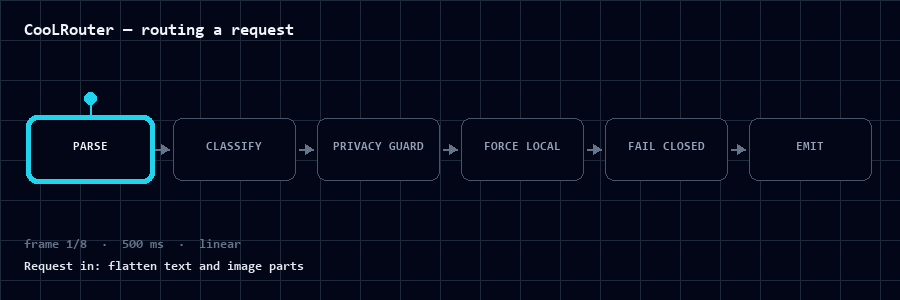

<p align="center">
  
</p>

<h1 align="center">CooLRouter</h1>

<p align="center"><strong>Which faculty should even be consulted — and how do you keep your trust from being bought by something that merely sounds certain?</strong><br>
An intent-guided, tiered routing layer for a local-first AI agent — where intuition is delegated, and where it is not.</p>

<p align="center">
  <a href="README-zh-TW.md"><strong>繁體中文導讀 →</strong></a>
</p>

<p align="center">
  <code>Tier 0 · Local</code> · <code>Tier 1 · Cloud</code> · <code>Tier 2 · Research</code> · <code>Tier 3 · Trend</code> · <code>Tier 4 · Agentic</code> · <code>Tier 5 · Critique</code>
</p>

<p align="center">
  
</p>

<p align="center">
  
</p>

<p align="center">
  
</p>

<p align="center">
  
</p>

<p align="center">
  
  
  
  
  
  
</p>

<p align="center">
  <a href="#why-coolrouter">Why CooLRouter</a> · <a href="#the-six-tiers">The Six Tiers</a> · <a href="#how-routing-works">How Routing Works</a> · <a href="#the-guardrail">The Guardrail</a> · <a href="#repository-layout">Repository</a> · <a href="#limitations">Limitations</a>
</p>

> **The cheapest model that verifiably does the job is the right model.**
> One request → one intent → one faculty. Cost-aware by principle, not reconciled afterwards.

## Why CooLRouter

The reflexive "one large model for everything" is seductive because it is simple. It is also
fiscally reckless and intellectually lazy. Simple demands — classifying, formatting, summarising,
short repair — do not require profound inference. The work is apportioned by **intent**, not by
whichever model happens to be resident. CooLRouter is the layer that makes that decision, per
request, before any model touches the input.

> This repository documents the routing architecture and patterns I use; environment values and
> proprietary content are deliberately absent. It is a sketch of an arrangement, not a shipped product.

It's built around three convictions:

- **Intent, not model** — the router dispatches by *what the task needs*, not by what's installed.
- **Cost is part of correctness** — a costly answer is not "better"; it's just costly. The useful
  number is *cheapest solution that verifiably works*, not the most impressive one.
- **Verify before trust** — a clean tool call is the *commencement* of verification, not its conclusion.

## The Six Tiers

| Tier | Engine | Best for | Cost / Privacy |
|:--|:--|:--|:--|
| **Tier 0 · Local** | on-device, small model | classify, format, short edits, routing | ~$0 · fully private |
| **Tier 1 · Cloud** | frontier, metered | deep reasoning, long context, vision | metered · remote |
| **Tier 2 · Research** | RAG + citations | papers, sources, grounded synthesis | retrieval-weighted |
| **Tier 3 · Trend** | real-time web | hot topics, live feeds, freshness | live · web-grounded |
| **Tier 4 · Agentic** | autonomous, multi-step | self-sustaining workflow | orchestration-bound |
| **Tier 5 · Critique** | self-eval, adversarial review | challenge the output before it ships; enforces the guardrail | guardrail-bound |

Here, **faculty** means "the tier plus the concrete skills and tools used to answer the request".

Two of these — research and trend — exist because *the kind of grounding* an answer demands is
itself a routing signal. A scholarly question wants provenance; a topical one wants freshness.
Neither is reducible to a general reasoning task. The top of the ladder — agentic and critique —
exists because work is not always a single answer: sometimes it is a *process*, and sometimes it
needs to be *challenged* after it is produced.

## How Routing Works

```
Request → Intention → Faculty → Guardrail → Execution → Corroboration → Output
```

<p align="center">
  
</p>

The routing core is published here: [`router/router-proxy.py`](router/router-proxy.py), documented
in [`docs/router-architecture.md`](docs/router-architecture.md) — the architecture diagram, the
13-stage decision chain, the tier table, the response contract, the guards, and the failure modes
that were found and fixed by adversarial review.

Three components carry more weight than any single model:

1. **The Intention Router** — decides *where* a matter is heard, based on what the matter is,
   before any model touches it. Cost-aware by principle, not reconciled afterwards.
2. **The Runtime** — an unremarkable loop. It summons the relevant skill, invokes real tools through
   scoped clients, and withholds the claim of completion until verification has been earned.
   The sophistication resides in the skill, not in the loop.
3. **The Skill Library** — procedural memory. An entry is a how-to for a recurring kind of matter,
   summoned only when pertinent, revised when it drifts or a deficiency reveals itself. Compound
   learning lives here.

Tooling is acquired with discretion and scoped: external capability via contextual servers, and
command-line tools drawn in narrowly (`npx`, `pip`) rather than accumulated into a sprawling
surface.

## The Guardrail

Beneath the tiers sits a condition every request must satisfy before it may be called done:

> **Never extend trust on self-report. Corroborate from more than one vantage. Test against the
> running system.**

In practice, the critique skills at Tier 5 are the last stop before a result may be called done.

Perception — image, frame, screenshot — is treated as a routing cue, not an afterthought, and held
to the same standard of verification as any text.

## What I deliberately decline

Each arrangement substitutes a shinier alternative — declined, usually for cost or for candour.

- *No monolithic system.* A lean loop with a compact set of precise skills is simpler to reason
  about, and less costly to repair.
- *No self-hosted frontier.* The local faculty exists for privacy and economy, not because a
  frontier is home-replicable.
- *No "defer to the largest."* It is the most expensive path, and rarely the most apt one.
- *No heedless automation.* The system runs unattended only where deterministic and low-risk;
  anything with consequence is shown to a human first.

## Repository layout

```
.
├── assets/        architecture.svg · demo.gif · social.mp4 · promo.mp4 · og-image.png
├── config/        environment config sample (values redacted, shape kept)
├── router/        router-proxy.py — the routing core, plus its own README
├── skills/        sample skill entries — the pattern, not the content
├── docs/          router-architecture.md (deep dive) · sonar-review · working notes
├── README.md      this file (English canonical)
├── README-zh-TW.md  繁體中文導讀 (reading guide)
└── LICENSE        MIT
```

The animated assets are generated: `demo.gif` (terminal session), `social.mp4` (7s loop),
`promo.mp4` (12s Remotion cinematic), `architecture.svg` (6-tier diagram). Their generators live
in `assets/_gen_*.py` and are gitignored — the source for `promo.mp4` is the full Remotion project
under `promo/`.

## Limitations

- **Personal tooling** — shaped for one machine and one workflow, not a general instrument.
- **Hardware-bound** — the local tier expects capable hardware; absent it, the tier contracts to
  classification and formatting. The architecture holds; the amplitude of the local tier diminishes.
- **Provider-leaning** — cloud and trend faculties rely on remote providers, so the arrangement
  favours simplicity over cross-vendor portability.
- **Honesty over numbers** — I report what I can corroborate. Where a number would require
  conjecture, you will find a statement instead.

## Why it's public

I work alongside an agent every day, and the honest version — the apportionment, the verification
discipline, the habit of advancing — is worth committing to paper for those curious yet unconvinced.
This is not a treatise asserting that systems replace engineers. It is one person's note on how an
agent was made useful without being permitted to become a liability.

It coexists with [**CooLEVAL**](https://github.com/CooLCHI-gun/CooLEVAL) — the reliability
instrumentation built on top of this same setup. CooLEVAL is the *measurement*; this is the
*workspace the measurement observes*.

## License

MIT — see [LICENSE](LICENSE).

<p align="center"><i>No raw configs, no PII, no proprietary work.</i></p>
