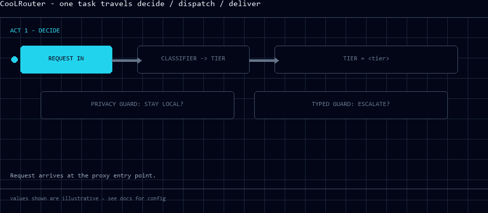
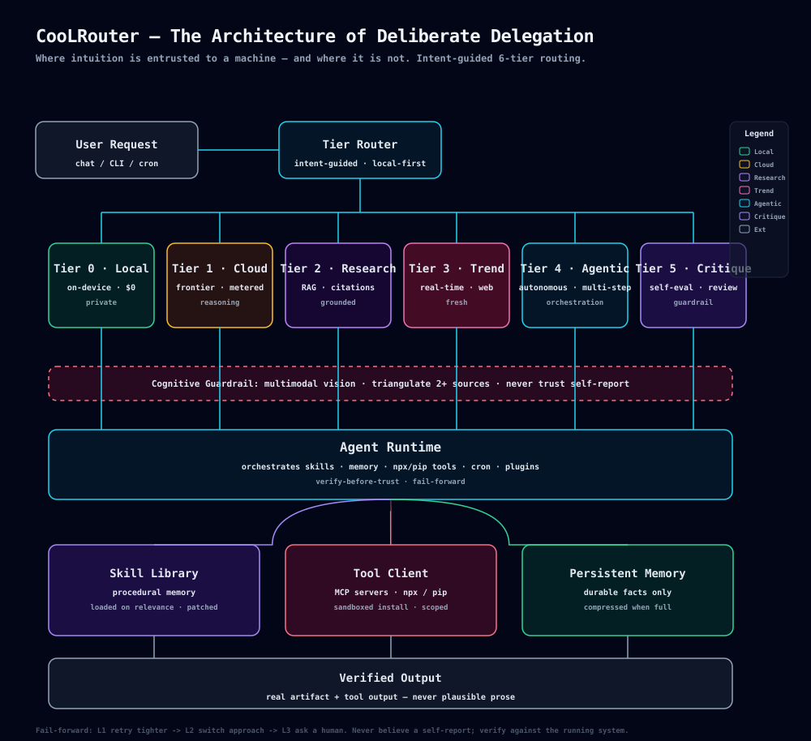
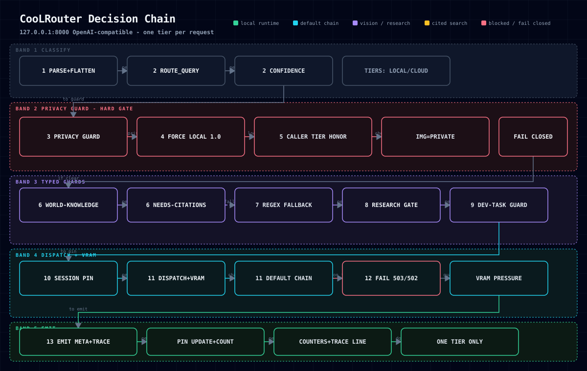

<p align="center">
  
</p>

<h1 align="center">CooLRouter</h1>

<p align="center"><strong>Which faculty should even be consulted — and how do you keep your trust from being bought by something that merely sounds certain?</strong><br>
An intent-guided, tiered routing layer for a local-first AI agent — where intuition is delegated, and where it is not.</p>

<p align="center">
  <a href="README-zh-TW.md"><strong>繁體中文導讀 →</strong></a>
</p>

<p align="center">
  <code>Tier 0 · Local</code> · <code>Tier 1 · Cloud</code> · <code>Tier 2 · Research</code> · <code>Tier 3 · Trend</code> · <code>Tier 4 · Agentic</code> · <code>Tier 5 · Critique</code>
</p>

<p align="center">
  
</p>

<p align="center">
  
</p>

<p align="center">
  
  
  
  
  
  
</p>

<p align="center">
  <a href="#why-coolrouter">Why CooLRouter</a> · <a href="#the-six-tiers">The Six Tiers</a> · <a href="#how-routing-works">How Routing Works</a> · <a href="#typed-decisions-jev">Typed decisions</a> · <a href="#the-guardrail">The Guardrail</a> · <a href="#deploy">Deploy</a> · <a href="#repository-layout">Repository</a> · <a href="#the-cache-is-where-the-money-is">The cache</a> · <a href="#measured">Measured</a> · <a href="#limitations">Limitations</a>
</p>

> **The cheapest model that verifiably does the job is the right model.**
> One request → one intent → one faculty. Cost-aware by principle, not reconciled afterwards.

## Why CooLRouter

The reflexive "one large model for everything" is seductive because it is simple. It is also
fiscally reckless and intellectually lazy. Simple demands — classifying, formatting, summarising,
short repair — do not require profound inference. The work is apportioned by **intent**, not by
whichever model happens to be resident. CooLRouter is the layer that makes that decision, per
request, before any model touches the input.

> This repository documents the routing architecture and patterns I use; environment values and
> proprietary content are deliberately absent. It is a sketch of an arrangement, not a shipped product.

It's built around three convictions:

- **Intent, not model** — the router dispatches by *what the task needs*, not by what's installed.
- **Cost is part of correctness** — a costly answer is not "better"; it's just costly. The useful
  number is *cheapest solution that verifiably works*, not the most impressive one.
- **Verify before trust** — a clean tool call is the *commencement* of verification, not its conclusion.

## The Six Tiers

| Tier | Engine | Best for | Cost / Privacy |
|:--|:--|:--|:--|
| **Tier 0 · Local** | on-device, small model | classify, format, short edits, routing | ~$0 · fully private |
| **Tier 1 · Cloud** | frontier, metered | deep reasoning, long context, vision | metered · remote |
| **Tier 2 · Research** | RAG + citations | papers, sources, grounded synthesis | retrieval-weighted |
| **Tier 3 · Trend** | real-time web | hot topics, live feeds, freshness | live · web-grounded |
| **Tier 4 · Agentic** | autonomous, multi-step | self-sustaining workflow | orchestration-bound |
| **Tier 5 · Critique** | self-eval, adversarial review | challenge the output before it ships; enforces the guardrail | guardrail-bound |

Here, **faculty** means "the tier plus the concrete skills and tools used to answer the request".

Two of these — research and trend — exist because *the kind of grounding* an answer demands is
itself a routing signal. A scholarly question wants provenance; a topical one wants freshness.
Neither is reducible to a general reasoning task. The top of the ladder — agentic and critique —
exists because work is not always a single answer: sometimes it is a *process*, and sometimes it
needs to be *challenged* after it is produced.

## How Routing Works

```
Request → Intention → Faculty → Guardrail → Execution → Corroboration → Output
```

<p align="center">
  
</p>

The routing core is published here: [`router/router-proxy.py`](router/router-proxy.py), documented
in [`docs/router-architecture.md`](docs/router-architecture.md) — the architecture diagram, the
13-stage decision chain, the tier table, the response contract, the guards, and the failure modes
that were found and fixed by adversarial review.

Three components carry more weight than any single model:

1. **The Intention Router** — decides *where* a matter is heard, based on what the matter is,
   before any model touches it. Cost-aware by principle, not reconciled afterwards.
2. **The Runtime** — an unremarkable loop. It summons the relevant skill, invokes real tools through
   scoped clients, and withholds the claim of completion until verification has been earned.
   The sophistication resides in the skill, not in the loop.
3. **The Skill Library** — procedural memory. An entry is a how-to for a recurring kind of matter,
   summoned only when pertinent, revised when it drifts or a deficiency reveals itself. Compound
   learning lives here.

Tooling is acquired with discretion and scoped: external capability via contextual servers, and
command-line tools drawn in narrowly (`npx`, `pip`) rather than accumulated into a sprawling
surface.

## Typed decisions instead of prose (Jev)

One stage of the chain is not a chat model at all. `typesafe/jev-1.13` returns a **typed** answer —
`Choice`, `Score` or `Noul` — with a calibrated probability, for roughly **$0.000027 per decision**
in 0.34–0.48 s. The router can therefore *act on a decision* instead of parsing a sentence.

Where it sits, and where it deliberately does not:

| Use | Question asked | What the router does with the answer |
|:--|:--|:--|
| `len_class` | how long should this answer be? | sets the local tier's output cap (one-line / short / detailed → 96 / 320 / 1200 tokens) |
| world-knowledge guard | does this need facts the model cannot hold? | a hit moves `local` **up** to a cloud tier, so a small model is never asked to recall a fact it will invent |
| citation guard | does this claim need sources? | a hit moves the request to the research tier |

Measured, not assumed — across 164 traced requests: the guards fired **5 times (3%)**; 61 of 80 local
requests paid for a length classification; and the 13 privacy-forced requests paid **nothing**, because
the privacy guard decides before Jev is ever consulted. Three implementation notes came straight out of
that measurement:

- **One call, not three.** Length classification and both guards are merged into a single decision call
  (`_jev_decide`); the original design made two sequential round-trips on the tier that is supposed to
  be the fastest.
- **Pure arithmetic never reaches it.** `2+2` short-circuits in code (`guard=['pure_calc:no_escalation']`),
  so a calculation costs zero cloud calls.
- **It can only move a request upward.** A guard can promote `local` to cloud; nothing can demote a
  cloud decision, so the tier division of labour cannot be scrambled by a classifier.

What we learned the hard way — the part worth copying:

- **A `Choice` returns exactly one option.** Asked to pick the durable items from a list of four, it
  answered 0.56 / 0.42 at confidence 0.43 — unusable. Ask one `Noul` per item instead.
- **Do not use it for language or encoding judgements.** A plainly Traditional-Chinese input scored
  0.47 on "is this traditional Chinese?".
- **It reads literally.** A winding-up petition scored 0.2 on "mentions an official source" until the
  criterion was written as an explicit condition.
- **Keep arithmetic and dates in code.** TypeSafe's own list of jagged edges — math, date comparison,
  indirection, large irrelevant state, contradictory criteria — is accurate.
- **It is a cloud call, so it never sits in front of private traffic.** The typed-decision model leaves
  the box; the privacy guard runs first and fail-closes to the local tier, where Jev is not consulted
  at all.
- **Measure it, or do not claim it.** `/healthz` reports `jev_calls` and every response carries
  `x-guard`, so "the guards are cheap" is a number rather than a belief.

## The Guardrail

Beneath the tiers sits a condition every request must satisfy before it may be called done:

> **Never extend trust on self-report. Corroborate from more than one vantage. Test against the
> running system.**

In practice, the critique skills at Tier 5 are the last stop before a result may be called done.

Perception — image, frame, screenshot — is treated as a routing cue, not an afterthought, and held
to the same standard of verification as any text. A request carrying an image is routed by a
dedicated image guard instead of being trusted to the text classifier; a privacy-forced request
stays home and is served by a local vision model, never by a text model reading base64 as prose.

## What I deliberately decline

Each arrangement substitutes a shinier alternative — declined, usually for cost or for candour.

- *No monolithic system.* A lean loop with a compact set of precise skills is simpler to reason
  about, and less costly to repair.
- *No self-hosted frontier.* The local faculty exists for privacy and economy, not because a
  frontier is home-replicable.
- *No "defer to the largest."* It is the most expensive path, and rarely the most apt one.
- *No heedless automation.* The system runs unattended only where deterministic and low-risk;
  anything with consequence is shown to a human first.

## Deploy

```sh
cp deploy/.env.example .env     # add only the keys you actually have
The fastest way to see it run - no clone, no virtualenv, no Python prerequisite (`uv` installs a
Python if the machine has none):

```bash
uv run https://raw.githubusercontent.com/CooLCHI-gun/CooLRouter/main/router/router-proxy.py 8000
```

For a permanent install as a service:

sh deploy/install.sh            # Linux / macOS   (./deploy/install.ps1 on Windows)
```

One Python file, no third-party dependencies. [`deploy/`](deploy/) carries the wrappers — install
scripts for both platforms, a `systemd --user` unit, a container path, and the config snippet that
serves an agent through it. The response carries the routing decision in its body
(`x-route`, `x-leg`, `x-ms`, `x-guard`, …), so you can always see *why* a request went where it went.

## Repository layout

```
.
├── assets/        demo-routing.gif (3-act demo) · architecture.svg · router-decision-chain.svg · social.mp4 · promo.mp4 · og-image.png
├── deploy/        install.sh · install.ps1 · Dockerfile · compose · systemd unit · Hermes config + plugin
├── config/        environment config sample (values redacted, shape kept)
├── router/        router-proxy.py · router-cache-probe.py · router-stats.py — the routing core · router-conformance.py · test-router-p0.py
├── skills/        sample skill entries — the pattern, not the content
├── docs/          router-architecture.md (deep dive) · sonar-review · working notes
├── README.md      this file (English canonical)
├── README-zh-TW.md  繁體中文導讀 (reading guide)
└── LICENSE        MIT
```

The animated assets are generated: `demo-routing.gif` (20 frames, 12.4s — one task travelling
decide → dispatch → deliver), `social.mp4` (7s loop), `promo.mp4` (12s Remotion cinematic),
`architecture.svg` (6-tier diagram). Their generators live in `assets/_gen_*.py` and are
gitignored — the source for `promo.mp4` is the full Remotion project under `promo/`.

## The cache is where the money is (measured)

The cloud legs bill input at **$0.15/M on a miss and $0.003/M on a hit** - a 50x gap - so the most
expensive thing a router can do is make a prefix un-cacheable. Measured against the live legs with
`python router/router-cache-probe.py`:

| prefix | cached_tokens | hit | input cost | vs uncached |
|:--|--:|--:|--:|--:|
| ~232 tokens | 0 | 0% | $0.000035 | 1.0x |
| ~285 tokens | 256 | 90% | $0.000005 | **8.4x** |
| ~446 tokens | 384 | 86% | $0.000010 | **6.4x** |
| ~927 tokens | 896 | 97% | $0.000007 | **18.9x** |
| ~1837 tokens | 1792 | 98% | $0.000012 | **22.7x** |
| ~3657 tokens | 3584 | 98% | $0.000022 | **25.3x** |

Three things this establishes:

1. **The floor sits around 256 tokens** (232 -> 0%, 285 -> 90%) and every cached amount is a multiple
   of 64 - block granularity, so a prefix shorter than a few blocks can never earn the discount. A
   one-shot prompt lives below the floor; an agent session lives far above it.
2. **A leg switch does not lose the cache.** Same model id on both legs, so GO -> ZEN -> GO held at
   **98% on every step**: failover is free in cache terms, while switching *model* starts again at 0.
3. **The router's contribution is negative-space work.** It never rewrites, re-orders or stamps the
   messages it forwards (it only reads the final turn), so a client's prefix stays byte-identical and
   keeps hitting. Injecting per-request text into the system prompt would cost every client ~25x on
   input - the most expensive thing a "helpful" router can do.

What is *not* claimed here: the mechanism is not novel - any pass-through proxy preserves a prefix.
What is uncommon is measuring it, publishing the floor, and shipping the probe so the table can be
reproduced or refuted.

Honest limits: one run showed a 0% hit at ~927 tokens that did not reproduce (a cache-write race - the
repeat arrived before the write landed), so treat a single miss as noise and re-probe. The provider
returns `cache_write_tokens: null`, so write costs cannot be reported. Prices are the recorded rates
from the tier notes.

## Measured

Every number below comes from `logs/router-trace.jsonl` (the router writes one line per request) and
can be reproduced with `python router/router-stats.py <trace>`. The sample is 284 requests over 26
hours of development traffic, and most of it is deliberately synthetic (`source=explicit`, 58%), so
read it as a description of **how the router behaves** - not as a production workload.

| | requests | share |
|:--|--:|--:|
| local | 147 | 51.8% |
| cloud (flash / vision / meta) | 116 | 40.8% |
| research | 21 | 7.4% |

**The cost centre is the research tier, not tokens.** Cloud token spend for the whole sample was
$0.000556 of input, while the 21 research calls each carry a per-call search floor of $0.005-$0.014,
i.e. **$0.105-$0.294**. That is 200-500x the entire token bill. Gating research behind guards is what
moves money; shaving tokens does not.

**Local is not slower than cloud in the median - it is just less predictable.** `gemma3:4b` answered
in 1.86 s median against 1.99 s for the cloud flash leg, but its p90 is 15.6 s versus 6.7 s: that
tail is model loading, not inference.

**An earlier reading of local vision was wrong, and the correction matters.** Same image, same 48-token
cap, three runs each: the cloud leg (ZEN, `deepseek-v4-flash-vision-exp`) took 1.34-4.63 s but spent the
entire cap on reasoning and never stated the colour, while local Qwen3-VL-4B took 8.3 s on the first
call (loading the model) and then **0.06-0.08 s** warm - answering "Blue" correctly. So the 18.9 s
median in the trace is mostly model-SWAP cost, not inference: on a 6 GB card the text model and the VL
model evict each other, and a trace full of alternating requests measures loading, not speed. Local
vision is a privacy feature first, but on a resident model it is also the faster and more direct answer.

**The primary leg never failed in this sample**: 116 of 116 cloud requests were served by the first
leg, with zero fallbacks and zero empty completions. The classifier costs 79 ms median.

**Prefix caching works - this sample simply could not use it.** Every row shows `cached_tokens` 0, and
the reason is prompt length: cloud requests here averaged 32 tokens, and a short prefix never hits.
Measured separately against the same leg: a 144-token prompt hit 0%, 716 tokens hit 89%, 2,042 tokens
hit 94%, 2,833 tokens hit 99.4%. On a repeated 2,042-token prefix the cache makes input **12.7x
cheaper** ($0.003/M on a hit against $0.15/M on a miss) - that is where the real saving lives, not in
the token count. The router helps by not touching the messages it forwards: injecting anything
per-request into the prefix would destroy that discount for every client. The dollar saving from
staying local is real but small in this sample ($0.0024 of avoided input); the case for the local
tier is latency, privacy and not needing the network - not the token bill.

## Limitations

- **Personal tooling** — shaped for one machine and one workflow, not a general instrument.
- **Hardware-bound** — the local tier expects capable hardware; absent it, the tier contracts to
  classification and formatting. The architecture holds; the amplitude of the local tier diminishes.
- **Provider-leaning** — cloud and trend faculties rely on remote providers, so the arrangement
  favours simplicity over cross-vendor portability.
- **Honesty over numbers** — I report what I can corroborate. Where a number would require
  conjecture, you will find a statement instead.

## Why it's public

I work alongside an agent every day, and the honest version — the apportionment, the verification
discipline, the habit of advancing — is worth committing to paper for those curious yet unconvinced.
This is not a treatise asserting that systems replace engineers. It is one person's note on how an
agent was made useful without being permitted to become a liability.

It coexists with [**CooLEVAL**](https://github.com/CooLCHI-gun/CooLEVAL) — the reliability
instrumentation built on top of this same setup. CooLEVAL is the *measurement*; this is the
*workspace the measurement observes*.

## License

MIT — see [LICENSE](LICENSE).

<p align="center"><i>No raw configs, no PII, no proprietary work.</i></p>
