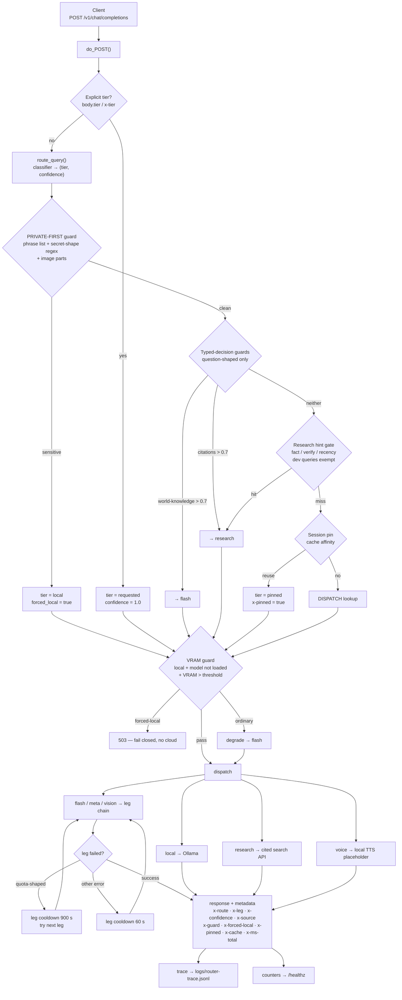

# Router Architecture — the routing core

> The implementation is `router/router-proxy.py` (~865 lines, Python stdlib + PyYAML).
> This document is the structure, the decision chain, and the failure modes — not marketing.
> Every number below was measured on a 6 GB consumer GPU (Windows 11) on 2026-09-23.

---

## 1. What it is

A **local-first, OpenAI-compatible proxy** on `http://127.0.0.1:8000/v1`. It accepts
`POST /v1/chat/completions`, decides **one tier per request**, forwards to that tier's provider, and
returns routing metadata alongside the answer.

Design goals, in priority order:

1. **Privacy first** — a request that looks like it carries a secret is forced onto the local model.
   If the local model cannot serve it, the proxy returns **HTTP 503 and fails closed**. It never
   falls back to a cloud provider for that request.
2. **Quota durability** — every cloud tier is a *chain of legs*: the metered subscription endpoint
   first, the pay-as-you-go endpoint second, a free endpoint third where one exists.
3. **Measurability** — one JSONL trace line per request plus per-tier counters, so "did routing make
   this faster or cheaper?" is answerable after the fact rather than assumed.
4. **Zero framework** — `http.server` and `urllib`. No FastAPI, no daemon, no container.

---

## 2. Architecture



---

## 3. Structure

| Component | Responsibility |
|---|---|
| `do_POST()` | The whole decision chain — single entry point |
| `route_query()` (external) | Classifier: embedding vector + modality flags → `(tier, confidence)` |
| `TIERS` | Tier table: endpoint, model, `api_key_env`, leg chain |
| `_call_chain()` | Try legs in order, skipping any leg in cooldown |
| `_call_leg()` | One HTTP call to one provider leg; validates the response semantically |
| `_call_ollama()` | Local generation, including `thinking`-field fallback and output cap |
| `_call_pplx()` | Cited search tier; escalates the model for long judgement queries |
| `_jev_len_class()` / `_jev_guards()` | Typed-decision calls: expected answer length, and whether a question needs world knowledge or citations |
| `_gpu_vram_used_mb()` | VRAM reading; returns a sentinel on failure so the guard degrades safely |
| `_trace()` / `_bump()` / `_health_stats()` | Trace append, per-tier counters, `/healthz` payload |
| `_sess_key()` / `_SESSION_PIN` | Session-level tier pinning for prompt-cache affinity, with TTL and a hard bound |

---

## 4. Decision chain

Order **is** precedence. The private guard locks the tier before any later stage can move it.

| # | Stage | Behaviour |
|---|---|---|
| 1 | Parse | Flatten multimodal content parts into text |
| 2 | Classify | `route_query()` → `(tier, confidence)`; `source = classifier` |
| 3 | Private guard | Unambiguous phrases plus regexes that require possessive/assignment context or a real key *shape*. Image parts count as potentially private |
| 4 | Force local | Sensitive and no explicit tier → `local`, `forced_local = true`, `confidence = 1.0` |
| 5 | Explicit tier | Caller-specified tier is honoured — but can never override forced-local |
| 6 | Typed-decision guards | Only for question-shaped requests on the weak local tier: world-knowledge → cloud, citations → research tier |
| 7 | Regex fallback | If the typed-decision call is unavailable, a narrow regex substitutes |
| 8 | Research gate | Precise fact / verify / recency patterns, with a coding-exempt list, because every cited-search call carries a search-context floor fee |
| 9 | Dev-task guard | A tier meant for audio/video plus dev keywords (python, sql, ffmpeg, srt) → flash |
| 10 | Session pin | Reuse the tier already serving this session when the modality matches and confidence is low — protects the upstream prefix cache |
| 11 | Dispatch + VRAM guard | Unknown classifier classes fall to the default chain; local under VRAM pressure degrades to flash for ordinary traffic and **fails closed** for forced-local traffic |
| 12 | Failure handling | Forced-local failure → 503; other failure → default chain; both dead → 502 |
| 13 | Emit | Metadata, one trace line, counters, pin update |

**Invariant:** an ambiguous noun alone never triggers the private guard. A bare `token` matches the
ordinary word in "usage tokens", and fail-closing ordinary engineering text silently downgrades a
cloud-quality request onto a small local model — a quality failure disguised as a safety feature.

---

## 5. Tiers

| Tier | Legs (in order) | Purpose |
|---|---|---|
| `local` | Local runtime | Privacy-first; simple requests. Must be a **non-thinking** instruct model, or the generation cap is consumed by the reasoning field |
| `flash` (default) | Subscription endpoint → metered endpoint, same model id | Agent default, tool calling, general work |
| `meta` | Same chain as `flash` | Not a capability — a classifier class for routing/self questions |
| `vision` | Cloud vision model (subscription → metered) → free endpoint | Images and OCR; legs 1–2 are the same model the agent's own vision path uses, so answers agree |
| `voice` | Local TTS | Placeholder only — returns a marker string, not audio |
| `research` | Cited search API, stronger model for long judgement queries | Real-time facts, verification, citations |
| *(retired)* | — | Strong/expensive tiers were removed: the default model is capable enough, and the classifier classes that still emit them fall through to the default chain at no extra cost |

---

## 6. Response contract

Metadata rides in the JSON body (**not** in HTTP headers):

| Field | Meaning |
|---|---|
| `x-route` | Final tier (`local`, `flash`, `flash(fallback)`, …) |
| `x-leg` | Which leg actually served (`go` / `zen` / `free` / `null` for local) |
| `x-confidence` | Decision confidence |
| `x-source` | `classifier` / `explicit` / `guard:*` / `pin` |
| `x-guard` | Which guards fired, with their scores |
| `x-forced-local` | Whether the privacy guard forced the local tier |
| `x-pinned` | Whether a session pin was reused |
| `x-cache` | Prompt tokens, cached tokens, completion tokens, cache-hit rate |
| `x-ms` / `x-ms-total` | Decision time / end-to-end time |
| `x-len-class`, `x-num-predict`, `x-think-stripped`, `x-done` | Local-tier output control and post-processing state |

---

## 7. Guards

| Guard | Trigger | Action | Why it exists |
|---|---|---|---|
| Private-first | Phrase list, or a regex requiring context or a real key shape | Force local; 503 on failure | Secrets must never leave the machine |
| World-knowledge | Typed-decision score > 0.7 | → cloud | A small local model cannot verify facts and will confabulate |
| Citations | Typed-decision score > 0.7 | → research tier | The request explicitly wants sources or recency |
| Research gate | Narrow fact/verify/recency patterns, non-coding | → research tier | Cited search has a per-call floor fee; the gate must stay narrow |
| Dev-task | Audio/video tier + dev keywords | → flash | "Write an ffmpeg script" is not a speech request |
| VRAM | Local tier + VRAM above threshold | Degrade ordinary traffic; **fail closed** for forced-local | A 6 GB card is shared with other GPU work |
| Leg cooldown | Quota-shaped error, else other error | Skip that leg for 900 s / 60 s | Do not hammer an exhausted subscription |

---

## 8. Observability

- **Trace**: one JSONL line per dispatch — timestamp, tier, leg, model, total ms, decision ms,
  confidence, source, forced-local flag, guards, length class, token and cache counters.
- **Counters**: `/healthz` exposes per-tier latency and token totals, cache hit rate, pin count and
  live pin count, guard counts, and the trace path.
- **Interpreting confidence**: `≥ 0.8` means the trained classifier is live. A value around
  `0.12–0.20` means the proxy silently fell back to the legacy centroid classifier — usually because
  it was started with an interpreter that lacks the classifier's runtime dependency.

```bash
# health gate
curl -s http://127.0.0.1:8000/healthz

# one routing decision (read the BODY, not the headers)
curl -s -X POST http://127.0.0.1:8000/v1/chat/completions \
  -H "Content-Type: application/json" \
  -d '{"messages":[{"role":"user","content":"explain YAGNI in one line"}],"max_tokens":32}'
# expect: x-route=local, x-source=classifier, x-confidence≈0.92

# privacy fail-closed
curl -s -X POST http://127.0.0.1:8000/v1/chat/completions \
  -H "Content-Type: application/json" \
  -d '{"messages":[{"role":"user","content":"my api key is sk-xxxx, redact it"}],"max_tokens":32}'
# expect: x-forced-local=true, x-route=local
```

---

## 9. What was broken, and what changed

Found by an adversarial review (a hosted reasoning model) cross-checked line-by-line against the
source, then fixed and re-verified with a functional test that stands up a fake upstream
([`router/test-router-p0.py`](router/test-router-p0.py) — 7/7 passing) and a table-driven
conformance suite that runs against the live proxy
([`router/router-conformance.py`](router/router-conformance.py) — 11/11 passing).

| Severity | Defect | Fix | Verification |
|---|---|---|---|
| **P0** | An upstream `HTTP 200` with empty content was accepted as success, so the caller got a blank answer and the chain never tried the next leg | Empty content (or no choices) now raises, so the chain advances | Fake upstream returning `{"choices":[{"message":{"content":""}}]}` → raises; good response → succeeds |
| **P0** | `HTTPServer` is single-threaded: one 12 s local generation or one 120 s cloud call blocked **every** other request | `ThreadingHTTPServer` with a global lock around shared state | 3 concurrent requests complete in 2.29 s wall (the slowest single one), not 3× |
| **P1** | Tool calls were silently dropped when the response was rebuilt | `tool_calls` are preserved and `finish_reason` reflects them | Response with `tool_calls` round-trips intact |
| **P1** | On Windows, the default `allow_reuse_address` let a **second** instance bind the same port, so two routers served interleaved requests with divergent state | `allow_reuse_address = False` — a second instance fails loudly | Two PIDs were observed listening on the same port before the fix |
| **P0** | The router forwarded its own bookkeeping keys (`_forced_local`, `_jev`) upstream; the provider answered `HTTP 400 Unsupported parameter(s)` and **the whole perception tier died** — every image request failed and both legs then sat in cooldown | `_call_leg` strips every `_`-prefixed key before the upstream call, so any future internal key is covered | A perception text request → `HTTP 200`, `leg=go` |
| **P0** | **Cooldown cascade**: a request-shaped error (400/422/validation) put a healthy leg into a 60 s cooldown, so one bad image made every later default-tier request return 502 | Request-shaped errors no longer cool down a healthy leg — cooldown is reserved for legs that are actually down | The default tier recovers immediately after a bad-image failure |
| **P1** | **Image requests were routed to a text tier**: a real 512×512 PNG was classified `local` (short, simple prompt), and the local call `json.dumps()`-ed the content list into `prompt` — the image never reached the runtime's `images` field, so the model described base64 as prose | A dedicated image guard routes image requests to the perception tier; the local call now splits text from `images` and switches to the local vision model; the cited-search gate also refuses image requests, which it cannot see; **image requests are exempt from the VRAM gate** — degrading one would hand a picture back to a text tier, so a slow local answer is preferred to a silent tier change | Conformance **11/11**; both image rows require `x-local-vision=true` (a real local generation, not just a decision); real 64×64 and 512×512 images answered correctly on **both** the cloud and the local-vision path |
| **P1** | A typed-decision guard false-positived on pure arithmetic (`what is 2+2` scored 0.9 on "needs world knowledge") and escalated a trivial question to a paid cloud tier | A pure-arithmetic regex short-circuits before the guard call (zero cloud calls); the guard instruction is now English and explicitly excludes calculation | Regex table 12/12; `what is 2+2` → `route=local`, `guard=['pure_calc:no_escalation']`, 0 cloud calls |
| **P2** | Every question-shaped local request paid two separate typed-decision round-trips (~0.3–0.6 s each) | Both questions are merged into one call | Measured `jev_calls` delta of 1 per local request |

**Still missing, and known to be missing:** request-body size caps, a per-request end-to-end
deadline shared by all fallbacks, concurrency limits, and cancellation when the client disconnects.
The conformance suite exists and is table-driven — 11 rows spanning arithmetic, privacy, escalation,
image routing, counters and concurrency — but it is run on demand, not in CI. The design is a working personal gateway, not a production
one, and this section is the honest boundary.

---

## 10. Cost model

| Path | Cost |
|---|---|
| Local tier | Electricity only |
| Default tier, subscription leg | Inside the monthly subscription |
| Default tier, metered leg | Per million tokens; a **cache hit is ~50× cheaper than a miss** on input, which is why session pinning exists |
| Research tier | A per-call search-context floor plus tokens — the reason the gate is narrow |
| Typed-decision guards | Fractions of a cent per call; bought to avoid a slow, wrong local answer |

---

## 11. Running it

```bash
# secrets live in the environment or in a gitignored env file — never in this file
export OPENCODE_GO_API_KEY=...        # subscription leg
export OPENCODE_ZEN_API_KEY=...       # metered fallback leg
export PERPLEXITY_API_KEY=...         # cited search tier (optional)
export NVIDIA_API_KEY=...             # free vision rescue leg (optional)

python3 router/router-proxy.py 8000
```

Requires a local OpenAI-compatible runtime for the local tier and a classifier module exporting
`route_query(text) -> (tier, confidence)`. That classifier — a trained logistic-regression model over
embeddings — belongs to the private profile this proxy was extracted from and is **not** included
here; `router/README.md` documents the interface it must satisfy.
