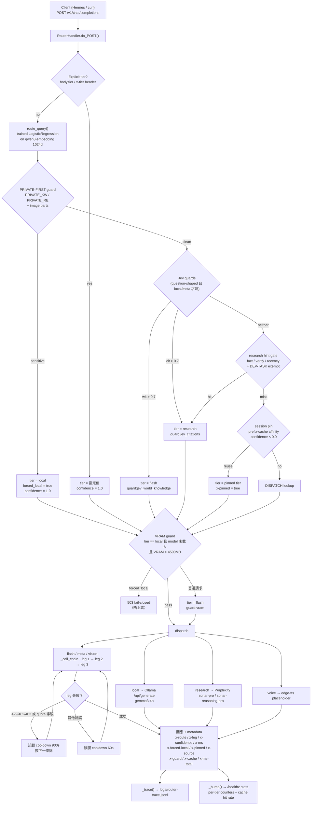

# CooLRouter — Smart Route 架構文件

> 本文件描述 `scripts/router-proxy.py`（v2，846 行，stdlib + PyYAML）的設計：架構圖、元件結構、決策邏輯鏈、契約、護欄與已知限制。
> 所有數字均為 2026-09-23 在本機實測所得，非估算。

---

## 1. 系統定位

CooLRouter 是一個 **local-first 的 OpenAI-compatible proxy**（`http://127.0.0.1:8000/v1`）。
它接收 `/v1/chat/completions` 請求，在 **單一請求內** 決定使用哪一個 tier（本機 4B、cloud flash、vision、research），
然後把請求轉發到對應 provider，並在回應中附上完整的 routing metadata。

設計目標（按優先順序）：

1. **Privacy first** — 含 PII／secret 的請求強制留在本機，失敗時 **fail-closed（HTTP 503）**，永不 fallback 到 cloud。
2. **Quota durability** — 每個 cloud tier 都是「腿鏈」（leg chain）：月費訂閱優先，額度耗盡自動切換到計量 endpoint。
3. **Measurability** — 每一個決策都寫入 trace，回應帶 `x-route`／`x-source`／`x-guard`，事後可逐筆審計。
4. **Zero dependency** — 只用 Python stdlib（`http.server`、`urllib`）+ PyYAML；無 framework、無 daemon。

---

## 2. 架構圖



---

## 3. 元件結構

| 元件 | 位置 | 職責 |
|---|---|---|
| `RouterHandler.do_POST()` | L574–L837 | 全部決策邏輯（唯一入口） |
| `route_query()` | `scripts/memory_enhancer.py` | Trained classifier：1024d embedding + 3 modality flags → 8-class tier |
| `TIERS` | L200–L254 | tier 定義表（endpoint、model、`api_key_env`、chain） |
| `_call_chain()` | L462 | 依序嘗試 legs，跳過 cooldown 中的腿 |
| `_call_ollama()` | L370 | 本機 Ollama `/api/generate`，含 `thinking` fallback 與 `num_predict` cap |
| `_call_pplx()` | L516 | Perplexity 呼叫，長判斷查詢自動升 `sonar-reasoning-pro` |
| `_jev_len_class()` / `_jev_guards()` | L289 / L319 | 用 TypeSafe Jev（typed decision）判斷答案長度與是否需要世界知識／出處 |
| `_gpu_vram_used_mb()` | L51 | VRAM 讀取（nvidia-smi），失敗回 sentinel |
| `_trace()` / `_bump()` / `_health_stats()` | L78 / L88 / L111 | trace 落盤、per-tier 計數、`/healthz` 輸出 |
| `_sess_key()` / `_SESSION_PIN` | L131 / L127 | Session 級 tier 釘選（prefix-cache affinity），TTL 7200s，上限 800 筆 |
| `start-router.sh` | `scripts/` | 啟動 Ollama → proxy（**必須用 `venv-router` python**） |
| `router-keepalive.py` | `scripts/` | 由 Hermes cron 呼叫的健康檢查 + 自動重啟 |

---

## 4. 邏輯鏈（決策順序，含行號）

| # | 步驟 | 行號 | 行為 |
|---|---|---|---|
| 1 | 解析請求 | L574–L592 | 抽出 `query_text`；multimodal 的 `content` list 會被攤平 |
| 2 | Classifier 決策 | L593 | `route_query()` → `(tier, confidence)`，`tier_source = "classifier"` |
| 3 | PRIVATE-FIRST guard | L611–L641 | `PRIVATE_KW`（片語）+ `PRIVATE_RE`（需要 possessive／assignment context 或真實 key 形狀）；image part 一律當可能私密 |
| 4 | 私密強制本機 | L644–L658 | `has_sensitive` 且無 explicit tier → `tier = local`、`confidence = 1.0`、`forced_local = true` |
| 5 | Explicit tier 優先 | L644–L658 | `body.tier` 或 `x-tier` header 直接指定（但仍不能覆蓋 forced-local） |
| 6 | Jev guards | L667–L681 | 只在「非 forced-local、無 explicit tier、question-shaped」時跑：`wk > 0.7` → flash；`cit > 0.7` → research |
| 7 | Factual regex fallback | L694–L700 | Jev 不可用時，用 regex 補上（`guard:factual_regex`） |
| 8 | Research hint gate | L735–L743 | 精準的 fact／verify／recency pattern；`CODING_EXEMPT` 阻止 dev query 進入付費搜尋 |
| 9 | DEV-TASK guard | L749–L754 | `voice`／`video` + dev keyword（python、sql、ffmpeg、srt…）→ flash |
| 10 | Session pin | L761–L769 | 同 session 前一次 tier 且 modality 相同、confidence < 0.9 → 沿用（保護 prompt cache） |
| 11 | Dispatch + VRAM guard | L773–L797 | 未知 tier（`pro`／`premium`／`video`）→ flash；local 且 VRAM > 4500MB → 普通請求降 flash，forced-local → **503** |
| 12 | 失敗處理 | L806–L811 | forced-local 失敗 → 503（不上雲）；其他失敗 → flash fallback；兩者皆失敗 → 502 |
| 13 | 回應與觀測 | L813–L836 | 寫入 metadata、`_trace()`、`_bump()`、更新 session pin |

**關鍵性質：** 順序即優先權。`forced_local`（步驟 4）在任何後續 guard 之前就鎖死，因此「私密流量永不上雲」不受後面的 Jev／research gate 影響。

---

## 5. Tier 表

| Tier | 腿（依序） | Model | 用途 |
|---|---|---|---|
| `local` | Ollama `:11434` | `gemma3:4b`（non-thinking instruct） | PRIVATE-FIRST；簡單請求；**必須用 non-thinking model**，否則 reasoning 會食盡 generation cap |
| `flash`（default） | ① GO（月費）→ ② ZEN（計量） | `deepseek-v4.1-flash` | Agent 預設、tool call、一般工作 |
| `meta` | 同 flash | 同上 | 不是獨立能力，只是 classifier 的「問路由」class |
| `vision` | ① GO → ② ZEN → ③ NVIDIA（免費） | `deepseek-v4-flash-vision-exp` → `nvidia/nemotron-3-nano-omni-30b-a3b-reasoning` | 圖像／OCR；leg 1–2 與 Hermes `auxiliary.vision` 同 model，答案一致 |
| `voice` | 本地 | `edge-tts` | **只回 placeholder 字串，不產生音檔**；真正 TTS 用 Hermes `text_to_speech` |
| `research` | Perplexity | `sonar-pro`（長判斷查詢升 `sonar-reasoning-pro`） | 需要 citation／即時資料／核實 |
| ~~`pro`~~ ~~`premium`~~ ~~`video`~~ | 已刪除（2026-09-20） | — | classifier 仍會輸出這些 class → DISPATCH 查不到 → 自動轉 default |

**GO endpoint 需要 `x-opencode-session` header**，缺少會回 `400 MissingSessionID`；proxy 固定送 `hermes-router`。

---

## 6. 回應契約

所有欄位附加在 JSON body 內（**不是** HTTP header）：

| 欄位 | 意義 |
|---|---|
| `x-route` | 最終 tier（例如 `local`、`flash`、`flash(fallback)`） |
| `x-leg` | 實際服務的腿：`go` / `zen` / `nvidia` / `null`（本機） |
| `x-confidence` | 決策信心（classifier 機率，或被 guard 提升後的固定值） |
| `x-source` | 決策來源：`classifier` / `explicit` / `guard:*` / `pin` |
| `x-guard` | 觸發的 guard 清單，例如 `["jev(wk=0.9,cit=0.07)", "jev:needs_world_knowledge"]` |
| `x-forced-local` | 是否由 PRIVATE-FIRST guard 強制本機 |
| `x-pinned` | 是否沿用 session pin |
| `x-cache` | `prompt_tokens` / `cached_tokens` / `completion_tokens` / `cache_hit_rate` |
| `x-ms` | 決策 + dispatch 前的耗時 |
| `x-ms-total` | 端到端耗時 |
| `x-len-class` / `x-num-predict` / `x-think-stripped` / `x-done` | 本機 tier 的長度控制與 thinking 剝離狀態 |

---

## 7. 護欄（Guards）

| Guard | 觸發條件 | 動作 | 設計理由 |
|---|---|---|---|
| PRIVATE-FIRST | `PRIVATE_KW` 片語或 `PRIVATE_RE` 形狀（`sk-…`、`ghp_…`、`nvapi-…`、`-----BEGIN … PRIVATE KEY-----`、`my <key\|token\|secret\|password>`） | 強制 `local`，失敗 503 | 私密資料永不上雲；**ambiguous noun 不會單獨匹配**（否則 `tokens` 這種普通字會把 cloud 品質的請求降級到 4B） |
| Jev world-knowledge | `wk > 0.7` | → `flash` | 本機 4B 無法核實事實，會 confabulate |
| Jev citations | `cit > 0.7` | → `research` | 需要出處／最新資料 |
| Research hint gate | 精準 fact／verify／recency pattern + 非 coding | → `research` | Perplexity 每次呼叫都有 search-context floor（約 $0.005–0.014），所以 gate 必須窄 |
| DEV-TASK | `voice`/`video` + dev keyword | → `flash` | 防止「寫 ffmpeg 腳本」被當成語音／影片請求 |
| VRAM | `local` 且 VRAM > 4500MB | 普通 → `flash`；forced-local → 503 | 6GB 卡上與遊戲共存；私密請求寧願失敗也不外洩 |
| Leg cooldown | HTTP 429/402/403 或 quota 字眼 | 該腿停用 900s（其他錯誤 60s） | 額度耗盡時不重複撞牆 |

---

## 8. 觀測與可驗證性

- **Trace**：`logs/router-trace.jsonl`，每筆含 `ts`、`tier`、`leg`、`model`、`ms_total`、`classify_ms`、`conf`、`source`、`forced_local`、`guard`、`len_class`、token 與 cache 統計。
- **Counters**：`/healthz` 回傳 `stats.tiers`、`stats.pins`、`stats.jev_guards`、`stats.cache`（含 cache hit rate）。
- **驗證指令**：

```bash
# 1) 健康檢查（同時確認 classifier 是否為 trained 版本）
curl -s http://127.0.0.1:8000/healthz

# 2) 單筆路由驗證（讀 body 的 metadata，不是 header）
curl -s -X POST http://127.0.0.1:8000/v1/chat/completions \
  -H "Content-Type: application/json" \
  -d '{"messages":[{"role":"user","content":"explain YAGNI in one line"}],"max_tokens":32}'
# 預期：x-route=local、x-source=classifier、x-confidence ≈ 0.92

# 3) 私密流量 fail-closed 驗證（必須留在 local）
curl -s -X POST http://127.0.0.1:8000/v1/chat/completions \
  -H "Content-Type: application/json" \
  -d '{"messages":[{"role":"user","content":"my api key is sk-xxxx, redact it"}],"max_tokens":32}'
# 預期：x-forced-local=true、x-route=local
```

**判讀 classifier 是否正常**：`x-confidence ≥ 0.8` → trained classifier 生效；
若只有 0.12–0.20 → 已靜靜 fallback 到 legacy centroid（通常代表 proxy 用了沒有 scikit-learn 的 interpreter）。

---

## 9. 已知限制與問題（2026-09-23 實測）

### 9.1 已修復並驗證（2026-09-23）

| 嚴重度 | 缺陷 | 修復 | 驗證方式 |
|---|---|---|---|
| **P0** | 上游回 `HTTP 200` 但內容為空時被當成成功：呼叫者收到空白答案，而 leg chain 永遠不會嘗試下一條腿 | 空內容（或無 `choices`）改為 raise，令 chain 前進 | 假上游回 `{"choices":[{"message":{"content":""}}]}` → 正確 raise；正常回應 → 成功 |
| **P0** | `HTTPServer` 是單執行緒：一次 12 秒的本機生成或 120 秒的雲端呼叫會阻塞**所有**其他請求 | 改用 `ThreadingHTTPServer`，共享狀態以 `_LOCK` 保護 | 3 個並行請求 wall time 2.29 秒（＝最慢單個），非相加 |
| **P1** | 重建回應時 `tool_calls` 被靜默丟棄（工具呼叫經 router 會失效） | 保留 `tool_calls`，`finish_reason` 如實反映 | 帶 `tool_calls` 的回應完整往返 |
| **P1** | Windows 上預設 `allow_reuse_address` 容許**第二個** instance 綁同一 port：兩個 router 交錯服務、狀態分歧，而且「修復看似無效」其實是被舊 instance 服務 | `allow_reuse_address = False`，第二個 instance 直接失敗 | 修復前實測兩個 PID 同時 LISTENING 同一 port |
| **P0** | Router 把內部簿記 key（`_forced_local`、`_jev`）轉發上游，provider 回 `HTTP 400 Unsupported parameter(s)` → **整個 vision tier 死亡**，所有圖片請求失敗後兩條腿更進入 cooldown | `_call_leg` 於呼叫上游前剝除所有 `_` 開頭 key（未來任何內部 key 一併受保護） | vision 文字請求 → `HTTP 200`、`leg=go` |
| **P0** | **Cooldown 連鎖**：一個 request-shaped 錯誤（400／422／validation）令健康的 leg 進入 60 秒 cooldown → 一張壞圖令之後所有 flash 請求回 502 | request-shaped 錯誤不再冷卻健康的 leg（cooldown 只留給真正 down 掉的腿） | 壞圖失敗後 flash 立即恢復 |
| **P1** | **圖片請求被送去文字 tier**：真 512×512 PNG 經 classifier 判為 `local`，而本機呼叫把 content list 以 `json.dumps()` 塞入 `prompt` — 圖片從未以 Ollama 的 `images` 欄位傳入，模型於是「描述」base64 文字 | 新增 IMAGE GUARD（帶圖請求 → `vision` tier）；`_call_ollama` 正確分流 text／`images` 並改用本機 VL model；Perplexity gate 同時排除帶圖請求（Sonar 睇唔到圖）；**圖片請求豁免 VRAM gate**（慢但正確 ＞ 靜默降級去文字 tier） | conformance **11/11**：兩個 image row 都要求 `x-local-vision=true`（真實本地生成），64×64 與 512×512 真圖在 cloud 與本機 VL 兩條路徑答案皆正確 |
| **P1** | 純算術被 typed-decision guard 誤判為「需要世界知識」而升級付費 cloud tier | 呼叫 guard 前以 `_PURE_CALC` regex 短路（零雲端呼叫），guard instruction 改為英文並明確排除計算 | regex 表 12/12；`what is 2+2` → `route=local, guard=['pure_calc:no_escalation']`，雲端呼叫 0 次 |
| **P2** | 每個 question-shaped local 查詢付 2 次 typed-decision round-trip（~0.3–0.6s） | 兩個問題合併為一次呼叫 | trace 實測每次 local 請求 `jev_calls` delta = 1 |

完整功能測試：`scripts/test-router-p0.py`（以真假上游驗證，非 mock 自身程式碼），**7/7 通過**。
表驅動 conformance 測試：`scripts/router-conformance.py`（9 → 11 條 row，含 3 條圖片路由 row），**11/11 通過**。

### 9.2 仍待處理

| # | 問題 | 證據 | 影響 | 建議 |
|---|---|---|---|---|
| 1 | **`x-ms` 與 `x-ms-total` 差距大** | `x-ms=61.5` vs `x-ms-total=11945.6`（同一筆請求） | 容易誤讀為 router 慢；實際是本機模型 cold start | 文件已標明語義；可考慮另加 `x-ms-model` 欄位 |
| 2 | **Classifier 訓練資料是合成樣本** | 480 條模板生成樣本，97.1% 5-fold CV | 真實用戶查詢分佈可能不同，CV 數字偏樂觀 | 用 trace 累積真實查詢做 shadow 評估，再考慮重訓 |
| 3 | **`video` 無法處理** | router 只收 chat-completions 文字 payload | 帶片的請求無法路由 | 用 Hermes `video_analyze`；影片生成另開 API |
| 4 | **`voice` tier 是 placeholder** | 只回標記字串，不產生音檔 | 呼叫者若以為有音檔會失望 | 文件與 metadata 已聲明；真 TTS 用 Hermes 內建 |
| 5 | **`router-classifier.pkl` 未定期重訓** | 檔案時間 2026-07-26 | 模型與實際使用分佈逐漸脫節 | 加入定期重訓流程（`scripts/train-router.py`） |
| 6 | **本機文字模型與 VL 模型在同一張 6GB 卡上無法同時常駐** | 實測（已確認 GPU 在用）：Qwen3-VL 佔 3.25GB ＋ embedding 2.15GB ＝ 5.40GB / 6.14GB，載入 VL 時 gemma3 被 evict；cold load 8.7 秒 | 交替文字／圖片請求會互相換出模型，首次回應偏慢 | 屬硬體上限。設計決定：圖片請求**不因 VRAM 降級去文字 tier**（見 §9.1）；`keep_alive=3m` 控制常駐時間；換大 VRAM 機器即緩解 |
| 3 | **`x-ms` 與 `x-ms-total` 差距大** | `x-ms=61.5` vs `x-ms-total=11945.6`（同一筆請求） | 容易誤讀為 router 慢；實際是本機模型 cold start | 文件已標明語義；可考慮另加 `x-ms-model` 欄位 |
| 4 | **Classifier 訓練資料是合成樣本** | 480 條模板生成樣本，97.1% 5-fold CV | 真實用戶查詢分佈可能不同，CV 數字偏樂觀 | 用 trace 累積真實查詢做 shadow 評估，再考慮重訓 |
| 5 | **`video` 無法處理** | router 只收 chat-completions 文字 payload | 帶片的請求無法路由 | 用 Hermes `video_analyze`；影片生成另開 API |
| 6 | **`voice` tier 是 placeholder** | 只回標記字串，不產生音檔 | 呼叫者若以為有音檔會失望 | 文件與 metadata 已聲明；真 TTS 用 Hermes 內建 |
| 7 | **`router-classifier.pkl` 未定期重訓** | 檔案時間 2026-07-26 | 模型與實際使用分佈逐漸脫節 | 加入定期重訓流程（`scripts/train-router.py`） |

**目前穩定性：** trace 共 158 筆決策（local 75 / flash 69 / research 11 / meta 2 / vision 1），**HTTP 錯誤 0 筆**。
決策來源分佈：explicit 125、classifier 28、guard 4、pin 1。

---

## 10. 成本模型

| 項目 | 單價 | 備註 |
|---|---|---|
| `local` | $0 | 只用本機 GPU／電力 |
| `flash`（GO） | 月費訂閱內 | 永遠優先嘗試 |
| `flash`（ZEN fallback） | DeepSeek V4.1-Flash：off-peak miss $0.15/M、hit $0.003/M（peak 加倍） | **cache hit 比 miss 便宜約 50×**，所以 session pin 的價值高於 model 選擇 |
| `research` | 每次呼叫 search-context floor 約 $0.005–0.014 + token | 因此 gate 必須窄 |
| Jev（長度 + guards） | 約 $0.00002–0.00003 / 次 | 用極低成本換取本機 4B 的延遲與品質 |

---

## 11. 後續路線

1. ~~修 §9.2 的 guard 誤判與 typed-decision round-trip 合併~~ → **已完成（2026-09-23）**：純算術短路零雲端呼叫、兩問合併為一。
2. 補齊執行層：request body 大小上限、跨所有 fallback 的 end-to-end deadline、並發上限、客戶端斷線即取消。
3. 用真實 trace 做 shadow 評估，驗證 classifier 在真實分佈下的準確度。
4. 把 `LOCAL_VRAM_USED_MAX_MB` 與 model 名稱抽成 config（目前寫死，換機（例如 24GB VRAM）會誤觸發）。
5. ~~建立 table-driven conformance test~~ → **已建立（2026-09-23）**：`scripts/router-conformance.py`，11 條 row。下一步是掛進 CI／cron（現為手動執行）。
